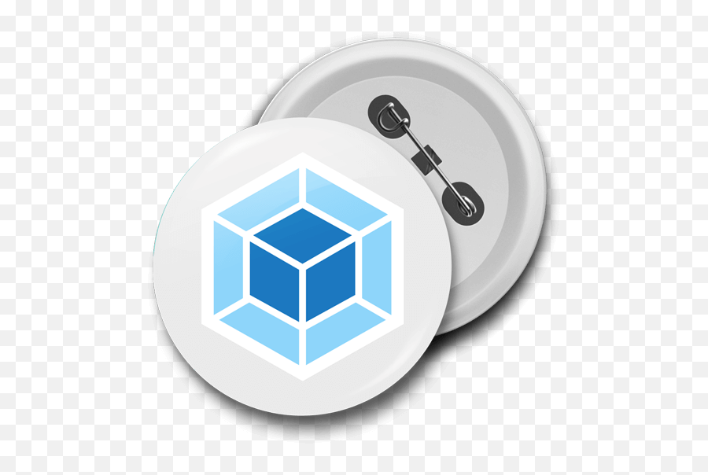
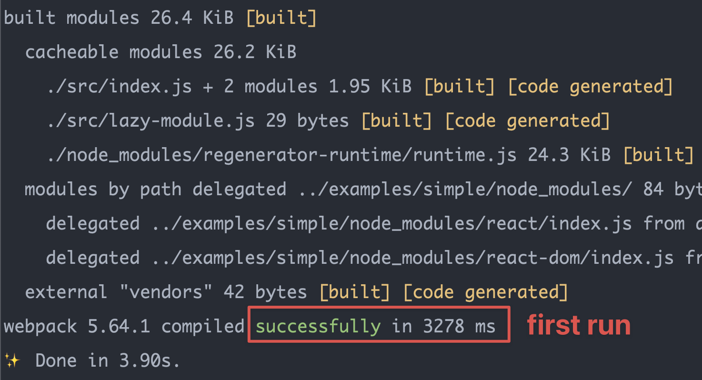
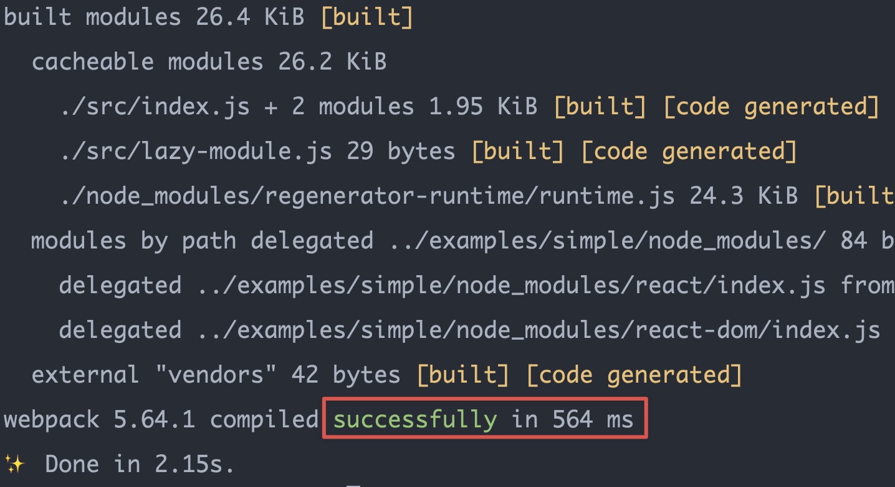

<div id="top"></div>
<!--
*** Thanks for checking out the Best-README-Template. If you have a suggestion
*** that would make this better, please fork the repo and create a pull request
*** or simply open an issue with the tag "enhancement".
*** Don't forget to give the project a star!
*** Thanks again! Now go create something AMAZING! :D
-->

<!-- PROJECT SHIELDS -->
<!--
*** I'm using markdown "reference style" links for readability.
*** Reference links are enclosed in brackets [ ] instead of parentheses ( ).
*** See the bottom of this document for the declaration of the reference variables
*** for contributors-url, forks-url, etc. This is an optional, concise syntax you may use.
*** https://www.markdownguide.org/basic-syntax/#reference-style-links
-->

[![Contributors][contributors-shield]][contributors-url]
[![Forks][forks-shield]][forks-url]
[![Stargazers][stars-shield]][stars-url]
[![Issues][issues-shield]][issues-url]
[![MIT License][license-shield]][license-url]
[![LinkedIn][linkedin-shield]][linkedin-url]

<!-- PROJECT LOGO -->
<br />
<div align="center">
  <a href="https://github.com/JimmyLv/webpack-autodll-plugin">
    
  </a>

<h3 align="center">@parabol/webpack-autodll-plugin</h3>

  <p align="center">
    AutoDLL Webpack Plugin for handling DLL caching outside of webpack.
    <br />
    <a href="https://github.com/JimmyLv/webpack-autodll-plugin"><strong>Explore the docs »</strong></a>
    <br />
    <br />
    <a href="https://github.com/JimmyLv/webpack-autodll-plugin/blob/master/examples/simple/webpack.config.js">View Demo</a>
    ·
    <a href="https://github.com/JimmyLv/webpack-autodll-plugin/issues">Report Bug</a>
    ·
    <a href="https://github.com/JimmyLv/webpack-autodll-plugin/issues">Request Feature</a>
  </p>
</div>

<!-- TABLE OF CONTENTS -->
<details>
  <summary>Table of Contents</summary>
  <ol>
    <li>
      <a href="#about-the-project">About The Project</a>
      <ul>
        <li><a href="#built-with">Built With</a></li>
      </ul>
    </li>
    <li>
      <a href="#getting-started">Getting Started</a>
      <ul>
        <li><a href="#prerequisites">Prerequisites</a></li>
        <li><a href="#installation">Installation</a></li>
      </ul>
    </li>
    <li><a href="#usage">Usage</a></li>
    <li><a href="#roadmap">Roadmap</a></li>
    <li><a href="#contributing">Contributing</a></li>
    <li><a href="#license">License</a></li>
    <li><a href="#contact">Contact</a></li>
    <li><a href="#acknowledgments">Acknowledgments</a></li>
  </ol>
</details>

<!-- ABOUT THE PROJECT -->

## About The Project

> AutoDLL Webpack Plugin for handling DLL caching outside of webpack.

You can use this Webpack plugin that includes DLL caching, to make your webpack builds as fast as HIGHLY optimized, and automatically based on your lockfile, e.g. `yarn.lock`

Before | After |
--------|-------|
|

<p align="right">(<a href="#top">back to top</a>)</p>

### Built With

- [Webpack](https://webpack.js.org/) for scaffold
- [Sucrase](https://github.com/alangpierce/sucrase) for compiling
  - todo: [TypeScript](https://www.typescriptlang.org/)
- [Jest](https://facebook.github.io/jest/) for testing
- [Prettier](https://prettier.io/) for code format
  - [lint-staged](https://github.com/okonet/lint-staged)
  - [simple-git-hooks](https://github.com/toplenboren/simple-git-hooks)
- [semantic-release](https://github.com/semantic-release/semantic-release)
  - auto generate [CHANGELOG](./docs/CHANGELOG.md)
  - auto publish to [NPM](https://www.npmjs.com/settings/parabol/packages)
  - auto release in [GitHub](https://github.com/JimmyLv/webpack-autodll-plugin/releases)
- [GitHub Action](https://github.com/JimmyLv/webpack-autodll-plugin/actions) as CI to build & test & publish 

<p align="right">(<a href="#top">back to top</a>)</p>

<!-- GETTING STARTED -->

## Getting Started

### Prerequisites

- Node.js
- NPM/Yarn

```sh
yarn add @parabol/webpack-autodll-plugin 
```

<!-- USAGE EXAMPLES -->

## Webpack Usage

```js
const path = require('path')
const WebpackAutodllPlugin = require('@parabol/webpack-autodll-plugin')

module.exports = {
  entry: './src/index.js',
  plugins: [
    new WebpackAutodllPlugin({
      vendors: ['react', 'react-dom', 'core-js'],
      // lockfile: 'yarn.lock',
    }),
  ],
}
```

_For the real example, please check out the `examples/` folder_

```shell
cd examples/simple
yarn build
yarn build # run it again to see the difference

rm -rf node_modules/.cache && rm -rf dev/dll && yarn build # clean all cache and run it again
rm -rf dev/dll && yarn build # clean dll cache and run it gain
```

<p align="right">(<a href="#top">back to top</a>)</p>

<!-- ROADMAP -->

## Features & Roadmap

Please see the [CHANGELOG](./docs/CHANGELOG.md) for a full list of features.

- [x] the buildDll.js logic is moved into a separate package & turned into a webpack plugin
- [x] the package is open sourced under the parabolinc github and under the `@parabol` in npm
- [x] instead of referencing the built dll output, the dev config references the dll config & the plugin builds it if the hash changes
  - see https://github.com/clinyong/dll-link-webpack-plugin for inspiration on the API
- [x] Suggested API: `({vendors: string[]} | {package: string, ignore?: string[]}) & {lockfile?: string}`
  - [x] vendors
  - [x] lockfile
  - [ ] package
  - [ ] ignore

<p align="right">(<a href="#top">back to top</a>)</p>

<!-- CONTRIBUTING -->

## Contributing

Contributions are what make the open source community such an amazing place to learn, inspire, and create. Any contributions you make are **greatly appreciated**.

If you have a suggestion that would make this better, please fork the repo and create a pull request. You can also simply open an issue with the tag "enhancement".
Don't forget to give the project a star! Thanks again!

1. Fork the Project
2. Create your Feature Branch (`git checkout -b feature/AmazingFeature`)
3. Commit your Changes (`git commit -m 'Add some AmazingFeature'`)
4. Push to the Branch (`git push origin feature/AmazingFeature`)
5. Open a Pull Request

<p align="right">(<a href="#top">back to top</a>)</p>

### How to Develop

1.Clone the repo

```sh
git clone https://github.com/JimmyLv/webpack-autodll-plugin.git
```

2. Install NPM packages

```sh
yarn #or npm install
```

3. Try the webpack plugin in `examples/simple` folder

```sh
cd examples/simple
webpack
```

4. Or you can try to use `jest` to `runWebpackExampleInMemory`

```shell
yarn test
```

<p align="right">(<a href="#top">back to top</a>)</p>

<!-- LICENSE -->

## License

Distributed under the MIT License. See `LICENSE.txt` for more information.

<p align="right">(<a href="#top">back to top</a>)</p>

<!-- CONTACT -->

## Contact

JimmyLv - [@Jimmy_JingLv](https://twitter.com/Jimmy_JingLv) - jimmy.jinglv@gmail.com

Project Link: [https://github.com/JimmyLv/webpack-autodll-plugin](https://github.com/JimmyLv/webpack-autodll-plugin)

<p align="right">(<a href="#top">back to top</a>)</p>

<!-- ACKNOWLEDGMENTS -->

## Acknowledgments

- [ParabolInc](https://github.com/ParabolInc/parabol)
- [Matt Krick](https://github.com/mattkrick)

<p align="right">(<a href="#top">back to top</a>)</p>

<!-- MARKDOWN LINKS & IMAGES -->
<!-- https://www.markdownguide.org/basic-syntax/#reference-style-links -->

[contributors-shield]: https://img.shields.io/github/contributors/JimmyLv/webpack-autodll-plugin.svg?style=for-the-badge
[contributors-url]: https://github.com/JimmyLv/webpack-autodll-plugin/graphs/contributors
[forks-shield]: https://img.shields.io/github/forks/JimmyLv/webpack-autodll-plugin.svg?style=for-the-badge
[forks-url]: https://github.com/JimmyLv/webpack-autodll-plugin/network/members
[stars-shield]: https://img.shields.io/github/stars/JimmyLv/webpack-autodll-plugin.svg?style=for-the-badge
[stars-url]: https://github.com/JimmyLv/webpack-autodll-plugin/stargazers
[issues-shield]: https://img.shields.io/github/issues/JimmyLv/webpack-autodll-plugin.svg?style=for-the-badge
[issues-url]: https://github.com/JimmyLv/webpack-autodll-plugin/issues
[license-shield]: https://img.shields.io/github/license/JimmyLv/webpack-autodll-plugin.svg?style=for-the-badge
[license-url]: https://github.com/JimmyLv/webpack-autodll-plugin/blob/master/LICENSE.txt
[linkedin-shield]: https://img.shields.io/badge/-LinkedIn-black.svg?style=for-the-badge&logo=linkedin&colorB=555
[linkedin-url]: https://linkedin.com/in/jimmy-lv
[product-screenshot]: images/screenshot.png
